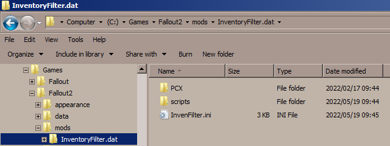
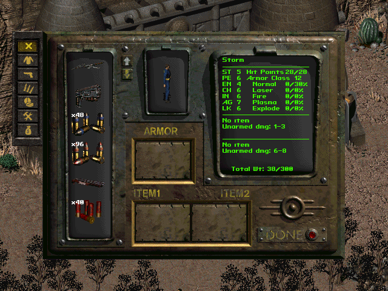
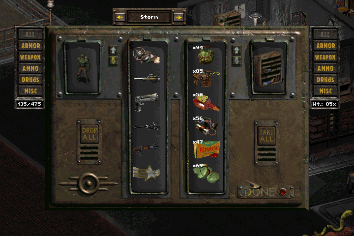
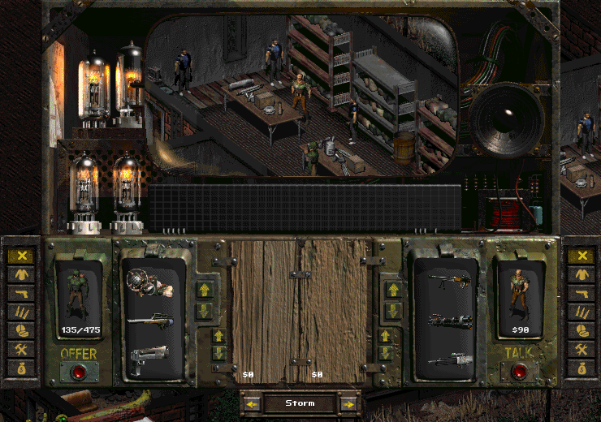

# Inventory Filter mod for Fallout 2

A mirror repository of the Inventory Filter mod for Fallout 2 by **Mr.Stalin**, based on the idea of JimTheDinosaur's [_Inventory Sort Buttons_ mod](https://www.nma-fallout.com/threads/inventory-sort-buttons-mod.203180).

## Features
* Quickly find ammo for weapons from tons of junk in the inventory: if you click the middle mouse button on the "Weapons" and "Ammo" menu buttons, these items will be displayed simultaneously in the player's inventory.
* Money is always shown at the top when bartering, or if the "All" filter is selected (the feature does not work right after opening the inventory).
* Quickly exchange your party members when bartering or opening containers.
* Displays the weight value for items in the selected category, as well as the number of coins the merchant has in barter.
* The "Drop All" button.
* Hotkeys to switch between the selected categories.

## Installation
1. Download `F2-InventoryFilter_v*_<language>.rar` from the _Releases_ page.
2. Extract the archive to main game directory.
3. Inventory Filter v1.6.1 requires [**sfall**](https://github.com/phobos2077/sfall) (`ddraw.dll`) version 4.2.2/3.8.29 or later to be fully functional.
   * `AllowUnsafeScripting` option in ddraw.ini must be enabled for the filter to function correctly.
   * The "Drop All" button is available only with `InterfaceDontMoveOnTop` option enabled. The option is always enabled in sfall 4.2.8+/3.8.29+.
4. Edit `mods/InventoryFilter.dat/InventoryFilter.ini` to configure the behavior of the filter.

This is how it's supposed to look like when installed:


* Note for sfall 3.8.x: move `PCX` and `scripts` folders into the `data` folder in main game directory after step 2.

## Usage Notes
* Click the middle mouse button on the "Weapons" and "Ammo" menu buttons to display items from these categories simultaneously in the player's inventory.
* Click the middle mouse button on the "Misc" menu button to display useful items from the miscellaneous category.
* To quickly switch between filter categories, use the hotkeys:
  ```
  Player: Q, 1, 2, 3, 4, 5
  NPC:    W, 6, 7, 8, 9, 0
  ```
  You can change the hotkeys in the configuration file.
* To turn the filter on or off, use the F11 key.

## Uninstallation
Delete `mods/InventoryFilter.dat` folder.
* If you installed the mod for sfall 3.8.x, delete `data/scripts/gl_InvenFilter.int` file and `data/PCX/inv_filter` folder as well.

## Screenshots





